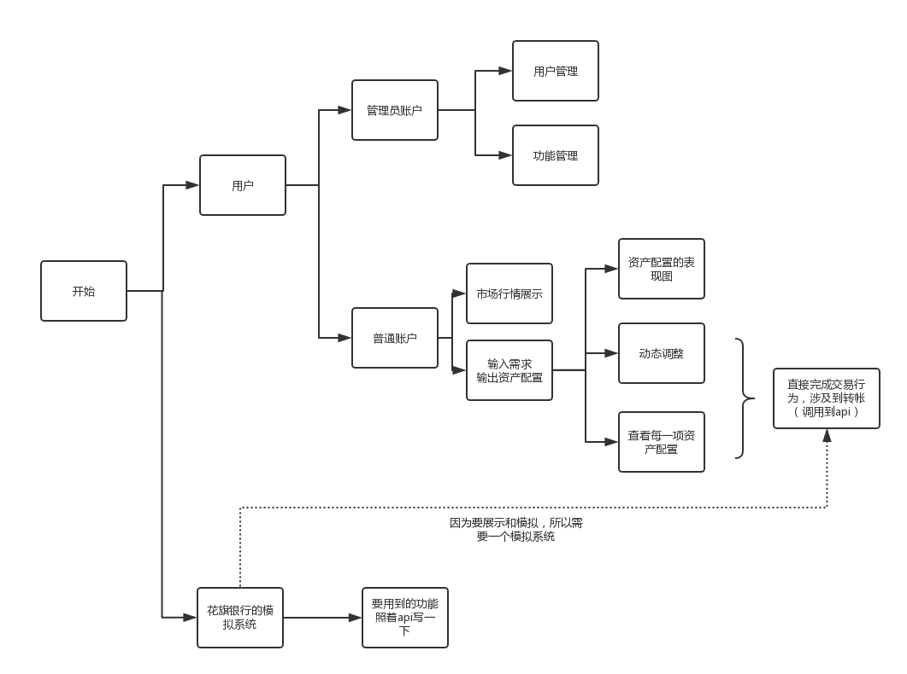
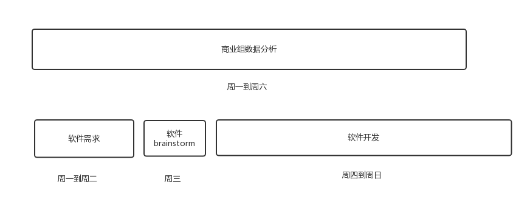
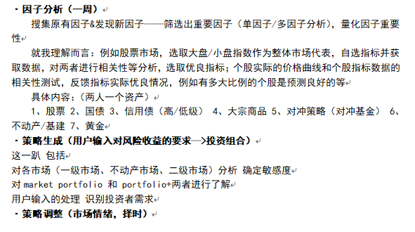
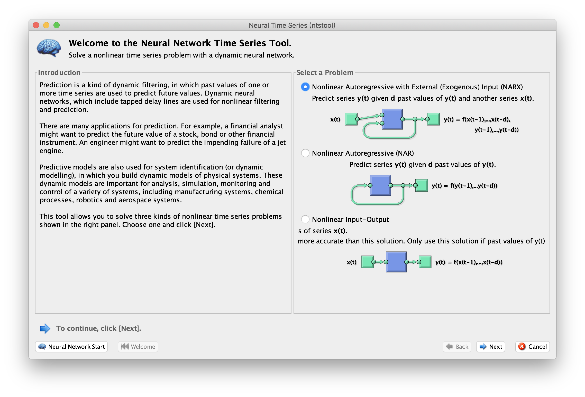
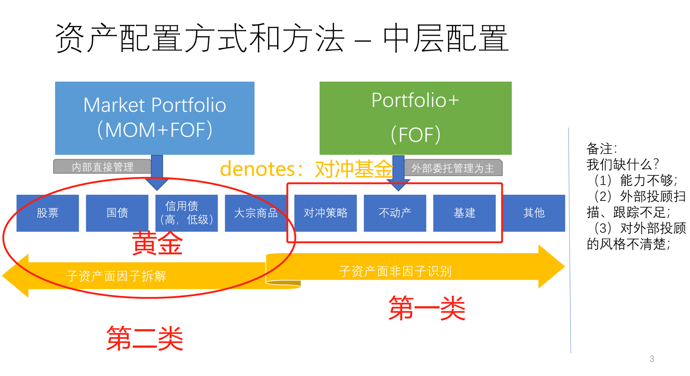
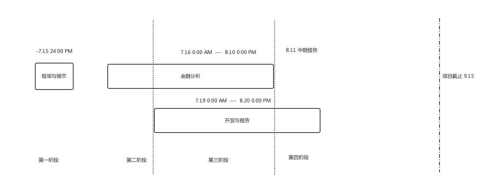
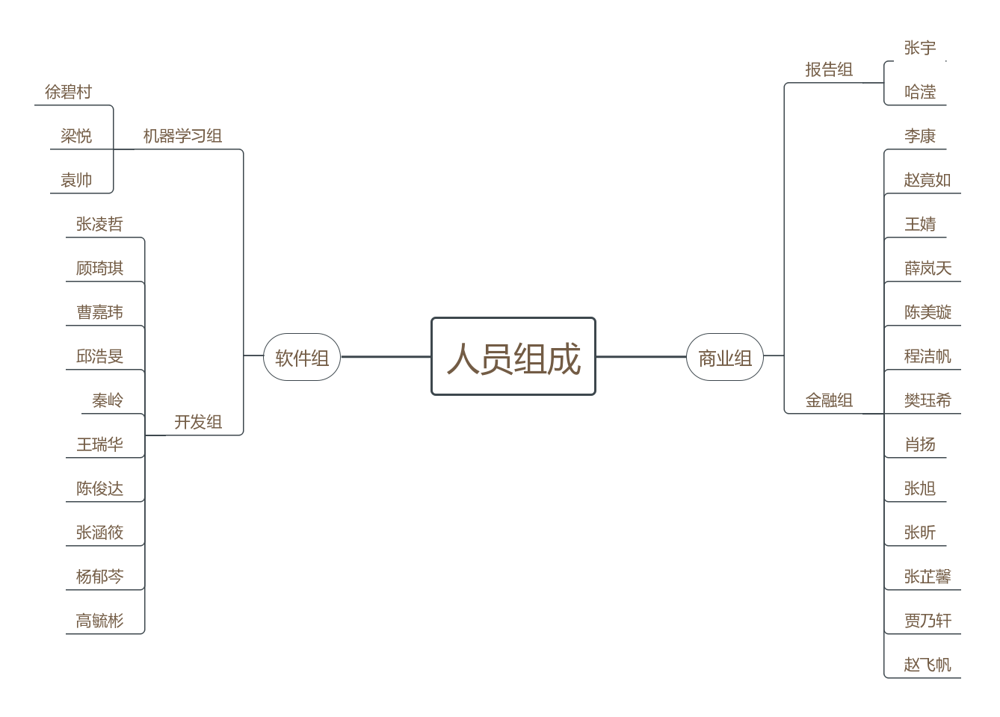

# CityCup
花旗杯项目

* [大赛官网](http://citicup.dufe.edu.cn/)
* 软件组【注意】：此次比赛需要调用[花旗的API](http://citicup.dufe.edu.cn/data/upload/ueditor/20180711/5b45d29aaa70d.pdf)，我理解的是我们可以分析花旗银行用户的信息，进行数据分析。~~给他们生成资产配置智能推荐【智能投顾】。~~
* 流程图、思维导图、人员组成在此查看与编辑：
  * [注册processon账号](https://www.processon.com/i/5b040baee4b05f5d6b64091b)
  * [加入小组](http://www.processon.com/team/invite/5b4394e3e4b00b08ad13db96/48Z4T4e6) （密码：2021）
  * 修改组内昵称，为真实姓名
  * @李康，获得编辑权限
* 不熟悉Markdown语法的同学，可以[参考此网页](https://github.com/guodongxiaren/README/edit/master/README.md)，在```Edit File```与```Preview Changes```之间对比学习。或者这篇[语法介绍](https://www.jianshu.com/p/191d1e21f7ed)。
* [量化投资多因子的解释](https://zhuanlan.zhihu.com/p/25849464)
* 请务必参考/参与[issues](https://github.com/FinTechNJU/FinBrain/issues)中的讨论！
* 项目介绍：<br>
  团队名称：FBrain<br>
  项目名称：FinBrain——基于大数据处理的资产量化管理系统<br>
  项目亮点：资产配置思路；因子择时<br>
  二百字简介：<br>
  我们的项目将提供一个根据用户需求来配置资产进行投资的投顾系统。<br>
  我们采用因子策略来进行市场预测和资产配置。在宏观数据的基础上，我们将生成指标和因子。通过回测，我们可以选取合适的因子，并剔除冗余或重复的因子。在合适的因子的基础上，我们通过因子择时和因子定价来配置投资组合，制定投资策略。<br>
  This program will provide a invest-consulting system in which assets can be allocated according to users’ demand.<br>
We conduct our market prediction and asset allocation according to factor strategy, where indicators and factors will be generated based on macro data. Via backtest, we pick out feasible factors and get rid of redundant or replicated factors. Based on feasible factors, we allocate market portfolio via factor-timing and factor-pricing, and make investment strategy.

<hr>



7.16-7.22第二周安排



* 市场风格是第二阶段的事情。
* 第一阶段要做到定量的程度。生成一个回归模型（神经网络）【机器学习】。

<a href="http://www.codecogs.com/eqnedit.php?latex=\begin{pmatrix}&space;x_{1&space;1}\\&space;x_{2&space;1}\\&space;...\\&space;x_{n&space;1}\end{pmatrix}" target="_blank"></a> :因子       &nbsp;&nbsp;&nbsp;&nbsp;&nbsp;&nbsp;&nbsp;&nbsp;&nbsp;&nbsp;&nbsp;&nbsp;&nbsp;&nbsp;&nbsp;&nbsp;&nbsp;&nbsp;&nbsp;&nbsp;&nbsp;&nbsp;&nbsp;&nbsp;&nbsp;&nbsp;&nbsp;&nbsp;&nbsp;&nbsp;&nbsp;&nbsp;&nbsp;&nbsp;&nbsp;&nbsp;&nbsp;                              <a href="http://www.codecogs.com/eqnedit.php?latex=\begin{pmatrix}&space;y_{1&space;1}\\&space;y_{2&space;1}\\&space;...\\&space;y_{m&space;1}\end{pmatrix}" target="_blank"></a> ：资产配置目标



* 下面还需要做归因分析。当两支基金表现相仿的情况下，要进行归因分析【机器学习】。归因分析我们放在第二个阶段来做。
* 分两类，一级市场，还有二级市场。对于一级市场要对基金进行分析。
* 因子我们可以看几篇论文，稳定的因子都有人已经分析好了。但是行研我觉得也很有价值。
* 指标和因子的区别，从数据里面生成的都叫指标。实际拿来用于时间序列模型的是因子。

市场分类：


<hr>



