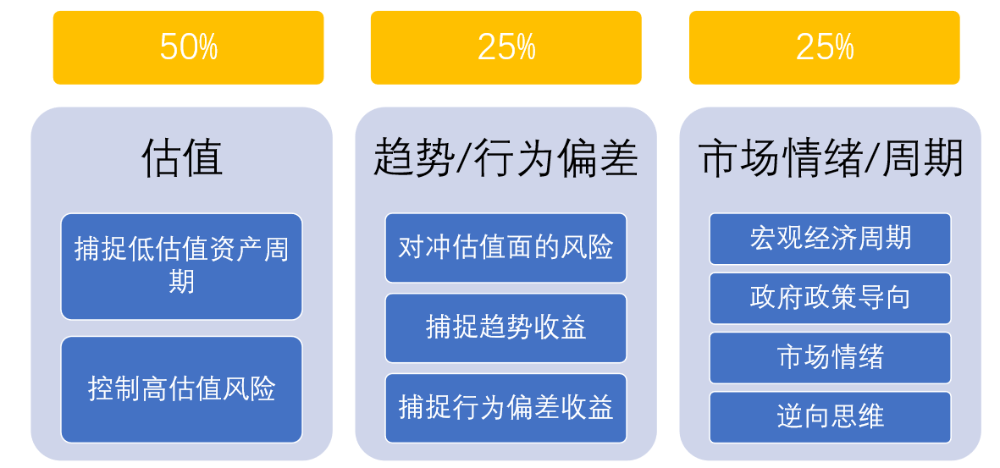
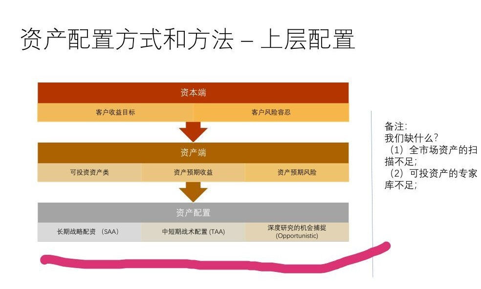

## 资产配置框架：
>以下是希望老师解答的问题，项目综述有不对的地方，也希望老师即时纠正
### 项目综述
**我们将设计一个体系，在这个体系中，输入为用户的需求，输出是我们给出的资产推荐，（并在后续根据市场表现实时调整），中间采用APT多因子定价模型。由于需要对采用的因子进行评价，所以需要用时间序列模型来做回归和预测。在此有大量的数据分析，并涉及到机器学习。**

### 存在问题
1. 首先当中挑选多因子，是一个怎么样的过程？我的理解是这样的：比方说，我整个市场里面有一百个因子，然后我们从中挑3个，然后在验证这个回归模型是否很好地实现了我们的目标。但是没有目的地去挑选的话，那就有种选法，这个任务量太大了，请问我们挑选因子是有什么有效的模式的吗？
2. 其次，我们在做多因子回归分析的时候，考虑的应该除了r还有&sigma;吧？假如有其他的用户的需求，我们还是需要再假如其他的被预测的元素的吧？

>以下是关于项目的介绍（for the convenience of the team's members）

### 一、上层配置：
根据用户的收益目标，风险容忍等信息推出用户可投资资产类，和这些资产的大概的预期收益和预期风险。进一步得出用户的长期战略配置，短期战术配置，深度的机会。
这一部分是比较宏观的得出关于用户资产配置的整体结论，
任务如下：
1. 对市场上所有可投资产 按风险，收益率，经验等因素进行分类，做到全市场的扫描，扩充可投资产库。
2. 根据用户的收益目标，风险容忍等信息筛选出符合的资产的种类
3. 根据可投的资产的种类的情况得出预期的收益和风险的范围。
4. 根据这些可投资产的性质（收益，风险。。。）进一步制定资产组合的短期和长期的策略
### 二、中层配置：
股票 国债 信用债 （高，低级） 大宗商品 对冲策略 不动产 基建 其他（特殊策略） 
等等可投资产的因子拆解和非因子识别。
任务如下：
1.  根据上层配置中选择的可投资产 进行 因子的拆解和 非因子识别。
2. 根据这些因子和非因子对资产的影响计算出最优的资产配置策略（各资产比例）
### 三、底层配置：
穿透性分拆 子资产面的因子和收益来源，穿透性组合因子构建配置和分配风险
任务：
1. 对中层配置中的因子进行进一步的分拆，找出更底层的因子。
2. 找出各资产的收益来源进行分拆，找出因子
3. 根据这些底层的因子进行配置和构建风险
### 四、战术调整：

根据战术配置调整的管理理念
进行评估，设置需要调整的标准，达到标准时，进行调整
任务：
1. 对市场的基本面，资本面，市场情绪面，其他（大小盘回测）等进行实时监控
2. 根据具体情况制定是否需要调整的标准，再根据监测到的信息进行判断是否需要调整
3. 根据具体的检测结果进行
系统性（量化为主）收割风险溢价
控制上层资产面市场风险
垂直调整组合因子配置和风险
因子上再因子 – 用因子来控制因子
顺应趋势，同时敢于逆向操作 
量化 + 人工操作
等方面的调整。

### 疑点难点
1. market portfolio与portfolio
2. SAA TAA Opportunistic

### 以上综述
资产配置：
自上而下的战略配置，自下而上的反馈

将自上而下的战略配置划分为上中下三层。
上层为对资产配置的宏观分析，包括从资本端分析客户预期和风险容忍能力，从资产端分析资产投资的风险及收益，和对资产配置的总体情况作一个全面的分析，对于这一问题，我们可能遇到全市场资产扫描不足及可投资产专家库不足这样的问题。
中层包括Market Portfolio 和 Portfolio+两个方面，前者为内部直接管理而后者以外部委托管理为主，具体来看，Market Portfolio由于是受到内部直接管理，有强掌控力，它建立在各类指数的基础上，根据需求配置不同的因子，从而实现对资产配置的灵活调整，但是资产配置的经验常常是缺乏的，Portfolio是内部能力的扩展，它在于寻找伙伴和双赢，在于双向对话，能带来前者没有的收益来源；
底层是对不同投资资产的因子的分析，分析诸如股票，股权，债券这些资产的影响因子，为逐步实现中层配置和上层配置提供量化条件，关于这一方向的研究还处于起步阶段。
在进行资产配置的过程中需要适时作出战略调整，对于配置的调整应考虑估值、趋势/行为偏差和市场情绪/周期三个方面，分别占比50%,25%和25%。

为实现以上目标，需进行以下方面的分析：
1. 基本面：货币利率，工业增速，固定投资，市场流动性等宏观基本面和公司的盈利能力等公司基本面。
2. 资金面：交易量，再融资金额（具体指对融资渠道的分析），限售股解禁数量等股票市场外部资金和政府政策（IPO政策）
3. 市场情绪面：波动率，市场多空情绪（包括涨跌停数量，RSI，IVIX等方面），避险资产的价格和交易量变化。

一些方法：
检测大小盘的相对业绩，相对业绩指标（ROE，净利润同比），数据有效性、一致性测试
涨跌幅择时逻辑、RSI择时逻辑等等。

### 总结：
实现的要点：
1. 解决老师ppt中提到的现在缺的方面。
2.  Market Portfolio和Portfolio+结合，进行更全面的资产配置。
3. 注重底层配置，对因子进行尽量底层的分解，直接用因子来构建配置和分配风险
4. 根据用户的信息，给出包括上层，中层，底层配置和调整情况的完整的资产配置方案。
5. 实时对模型根据市场变化进行调整，保证结果的有效性

