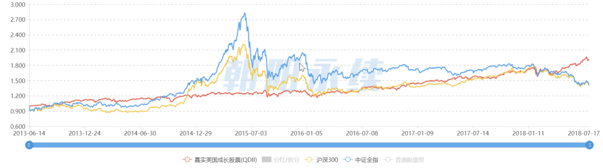
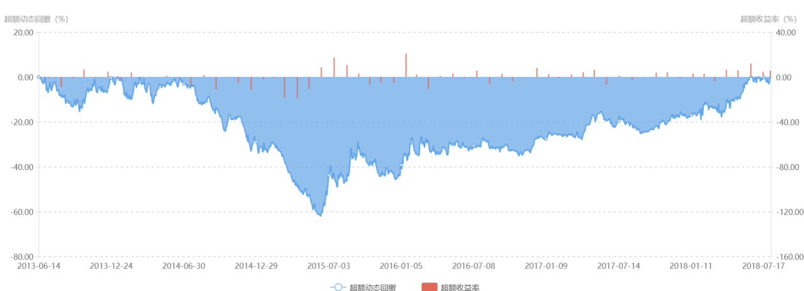

# 金融模块接口和参数定义

省略的导入部分

```python
from dataclasses import dataclass
from typing import Tuple, List, NewType
from pandas import DataFrame
from datetime import datetime
```

## 1. 用户注册、登陆以及个人信息的修改（不涉及金融模块）

## 2. 股票评价深度分析

###2.1 接口定义
```python
# 参数：stockcode 股票代码, function 功能 1：业绩分析 2：归因分析 3：场景分析(分成3个tab进行展示)
def stock_show(stockcode: str, function: int)-> tuple(stock_show1, stock_show2, stock_show3）
#返回值：各功能的深度分析行情展示
    pass
```
###2.2 返回值定义
```python
@dataclass
# 功能一
class stock_show1:
    value_show: dataframe          # 净值累计收益率比较图
    ({
      date: str   "%Y-%m-%d" # 时间 天
      stock_value: float 		# 当前股票该时刻相对净值（相对于开始时的净值）
      stock_gain: float   		# 当前股票该时刻累计收益率
      stockhs300_price: float	# 沪深300该时刻指数
      stockhs300_value: float	# 沪深300该时刻相对净值（相对于开始时的净值）
      stockzz_price: float 		# 中证指数该时刻指数
      stockzz_value: float       # 中证指数该时刻相对净值（相对于开始时的净值）
     }）
# 画图 以date为横轴，分别以stock_value，stockhs300_value ，stockzz_value为纵轴做折线图 鼠标点击对应点展示改点的date,stock_value,stock_gain,  stockhs300_price, stockhs300_value, stockzz_price,stockzz_value
        
    gain_risk: dataframe # 收益风险指标表 一共有三列 当前股票，沪深300，中证指数
    （{
        gainrate: float 	# 收益率
        annualgain: float 	# 年化收益率   
        annualrisk: float 	# 年化波动率
        max_retrace: float 	# 最大回撤
        retraceback: str  "%Y-%m-%d~%Y-%m-%d"  #最大回撤回补期
        alpha: float 		# alpa值
        beta: float 		# beta值
        sharpe_ratio: float 	# sharpe比例
        sortino_ratio: float # sortino比例
        clamar_ratio: float 	# clamar比例
        month_win: float 	# 月胜率（0,1）
        win_ratio: float 	# 平均损益比 （1,无穷）
	}）        
                     
   retrace_show: dataframe     	# 动态回撤收益率图
   （{
        date:str  "%Y-%m-%d" 	# 时间 天
        stock_retrace:float		# 当前股票该时刻动态回撤值（-1,0）
        stoc_monthgain_compare:float 	# 每月15日有该值，表示当月收益率与中证指数当月收益率的差，可正可负
     }）
    # 动态回撤为折线图，超额收益率为柱形图
      
```

### 2.3 界面参考



## 

可以参考朝阳永续网址：12345fund.com，用户名:E00055196，密码：739508  

## 3. 债券评价深度分析（迭代一不做）

## 4. 管理期货深度分析（迭代一不做）

## 5. 一级市场深度分析（迭代一不做）

## 6. 进行资产配置（迭代一仅仅针对股票市场进行资产配置）

### 6.1 用户提供投资需求，得到系统给出的股票投资方案

`需求 #6` `正常流程-1`

#### 6.1.1 接口定义

```python
# 参数：投资需求，用户ID
# ps:用户调整需求的时候整个更新需求
def add_invest_req(invreq: InvestReq, user_id:str) -> Tuple[float,List[StockInfo]]:
    # 返回值: 预期收益，股票信息列表
    pass
```

#### 6.1.2 参数定义

```python
@dataclass
class InvestReq:
    ror_bound: Tuple[float, float]  # 收益率：百分比上下界
    volatility_bound: Tuple[float, float]  # 波动率：百分比上下界
    investment_years: int  # 投资年限
    volume: float  # 投资额: TODO 精度限制
    # TODO 和用户绑定
```

#### 6.1.3 返回值定义

```python
@dataclass
class StockInfo:
    date: datetime # 时间:日期
    stockcode: str # 股票代码
    stockname: str # 股票名称
    price: float # 买入价格
    quantity: int # 买入数量
```

### 6.2 系统根据已有的资产配置方案得到收益（需要以多种图表来展现）

`需求 #6` `正常流程-3`

#### 6.2.1 接口定义

```python
# 参数：股票投资方案ID
def get_revenue(stock_sol_id: str) -> StockSolPerf:
    # 返回值：方案收益表现
    pass
```

#### 6.2.2 参数定义

- 股票投资方案ID，用一个字符串表示，例如 `'0e210c0b824b'`

#### 6.2.3 返回值定义

```python
@dataclass
class StockSolPerf:
    accu_revenue: float # 累计收益:百分率
    max_drawdowm: float # 最大回撤：百分率
    ror_year: float # 年化收益:百分率
    start_date :datetime # 开始时间
    start_volume :float # 初始资金
    
    # 以下浮点数取值范围为：0~100
    beta: float # 贝塔
    growth: float # 成长性
    leverage_ratio: float # 杠杆率
    liquidity: float # 流动性
    momentum: float # 动量
    reversal: float # 反转
    market_value: float # 市值
    price: float # 价值
    volatility: float # 波动率
    profitability: float # 盈利性
    
    industry: dict[str:float]# 版块情况，键为版块名（包括现金），值为百分比
    
    # Brinson 分析
    active_return: float # 主动收益:浮点，可为负数 
    asset_allo: float # 资产配置
    stock_allo: float # 选股配置
    
    # 收益图走势
    return_trend: List[Tuple[datetime, float, float]] # 时间，累积收益，参照收益（例如沪深300指数）:时间从策略产生日开始
    
    # 当前持仓
    cur_position: DataFrame
    ({ 
    	stockcode: str # 股票代码
        stockname: str # 股票名
	quantity: int # 持仓量
	price: float # 买入均价
	t_return: float # 累积盈亏：亏损为负
	})
    
    # 交易记录
    record: DataFrame
    ({
        date: datetime # 成交时间
	stockcode: str # 股票代码
	stockname: str # 股票名
	otype: enum # 枚举类型 买入or卖出
	price: float # 成交价
	quantity: int # 成交量
	})
```

### 6.3 用户查看股票投资方案表现 

`需求 #6` `扩展流程-1`

#### 6.3.1 接口定义

```python
# 参数：股票ID
def get_quotation(stockcode: str) -> Tuple[list[StockHistoryPrice],StockCurInfo]:
    # 返回值：股票历史价格列表，股票当前部分信息
    pass
```

#### 6.3.2 参数定义

- 股票代码，用一个字符串表示，例如 `'0384758'`

#### 6.3.3 返回值定义

```python
# 返回值定义
@dataclass
class StockHistoryPrice:
    # 用于画K线图
    date: datetime # 日期：哪天的价格
    max_price: float # 最高价
    min_price: float # 最低价
    opening: float # 开盘价
    closing: float # 收盘价
    change: float # 涨跌额
    chg: float # 涨跌幅：百分数，大小一般不超过10%
    volume: float # 成交量

@dataclass
class StockCurInfo:
    # 当日部分信息
    market_cap: float # 市值
    opening: float # 开盘价 
    volumn: float # 成交量
    turnover: float # 换手率
    closing: float # 收盘价（或者精确为当前价）
    PE: float # 市盈率
    change: Tuple[float,float] # 涨跌幅,涨跌幅
    Day_Range: Tuple[float,float] # 最低价，最高价
    Beta: float # 贝塔
    Sharpe: float # 夏普率
```

#### 6.3.4 参考资料

- [米筐某策略](https://www.ricequant.com/scrafts/1262487#1 )
- [BigQuant某策略](https://bigquant.com/live/shared/strategy?id=232#planned-orders)

### 6.4 用户根据推荐方案进行股票交易(用户直接授权之后转移资金，修改数据库，具体在数据库接口中)

`需求 #6` `扩展流程-2`

## 7. 修改资产配置方案

###7.1 系统帮助用户调整方案

`需求 #8` `正常流程-1`

#### 7.1.1 接口定义
```python
# 参数：股票投资方案ID, 持仓的修改方案(modify_plan['possess_id: str', 'modify_amount: int'])
def modify_possess(stock_solution_id: str, modify_plan: DataFrame) -> bool:
    # 返回值：是否成功
    pass
```
